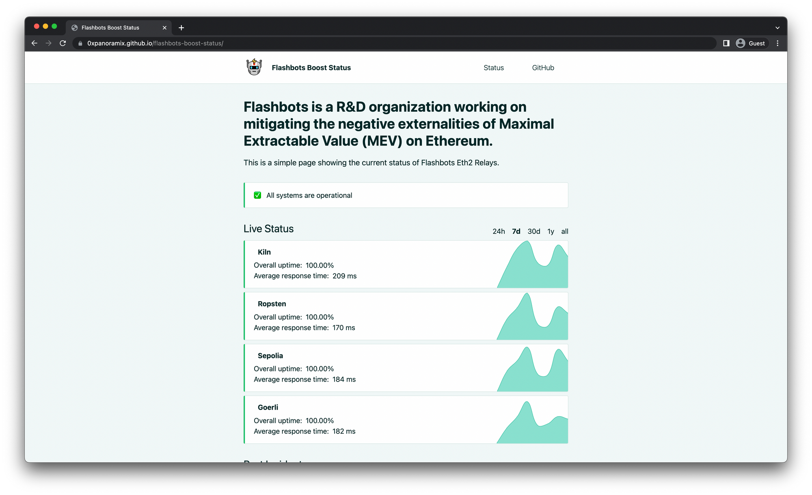

## Flashbots Relays Status

[Monitor Flashbots Relays](https://0xpanoramix.github.io/flashbots-boost-status/) status on various timescales, by 0xpanoramix.

## Flashbots Relay Data

As official Flashbots Relays expose data according to the [Data Transparency API](https://flashbots.notion.site/Relay-API-Spec-5fb0819366954962bc02e81cb33840f5#38a21c8a40e64970904500eb7b373ea5),
here is a client to query this API in your own solutions:

- [Golang Client](https://github.com/0xpanoramix/frd-go), by 0xpanoramix
